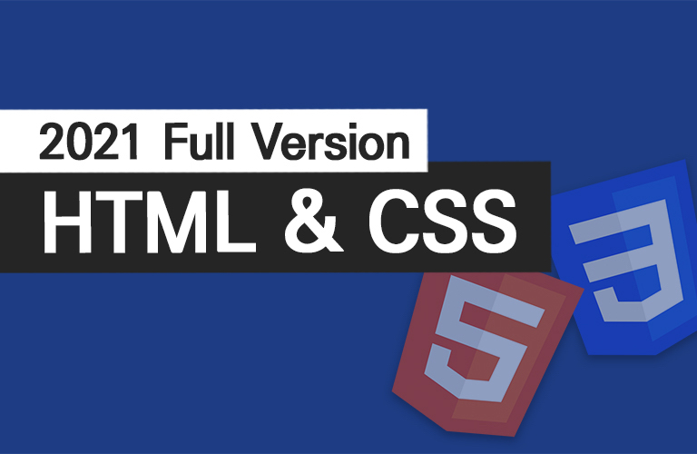

## HTML5 &amp; CSS3 독학백서 기초 무료 강의 🐥

- 강의는 유튜브 [개발자 이도해](https://www.youtube.com/playlist?list=PLI33CnBTx2MYe0rqJ2nMSbfUqLmWIJtaV) 채널 또는 [인프런](https://www.inflearn.com/course/html-css-%EA%B8%B0%EC%B4%88-%EB%AC%B8%EB%B2%95-%EC%98%AC%EC%9D%B8%EC%9B%90)에서 보실 수 있습니다.
- 질문은 [Issue](https://github.com/dohaelee/html-css-beginners/issues)로 생성해주세요.

### 교재

- [HTML5 독학백서](https://book.naver.com/bookdb/book_detail.nhn?bid=17892489)
- [CSS3 독학백서](https://book.naver.com/bookdb/book_detail.nhn?bid=18830214)
